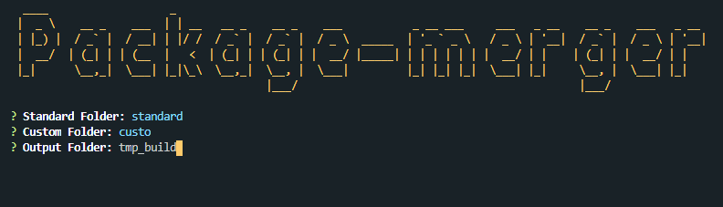

# package-merger

This is an utility when you have an overwrite project and you need to merge the package.json files.

# Usage

```sh
pm [source_folder1] [source_folder2] [output_folder]
```

OR

```sh
pm
```

and you will have this screen

